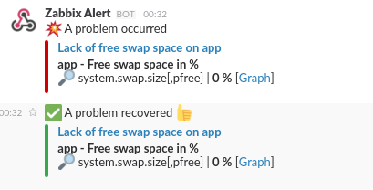

zbx2slack
================================

.. image:: https://travis-ci.org/laughk/zbx2slack-alert-notify.svg?branch=master
    :target: https://travis-ci.org/laughk/zbx2slack-alert-notify

Zabbix Alert Notification Script for Slack. by pure python.

- Can use by "Remote command". But can't use by "Media type".
- if use by python2.6 (like CentOS6.x), install ``argparse`` module.  ex, 

  .. sourcecode:: sh

     $  sudo yum install python-argparse

Screenshot
------------------

Notification example.

Install
-----------------------

In your zabbix server,

.. sourcecode:: sh

    $ wget https://raw.githubusercontent.com/laughk/zbx2slack-alert-notify/master/zbx2slack-alert-notify.py
    $ chmod +x zbx2slack-alert-notify.py

or if you can use ``git``,

.. sourcecode:: sh

    $ git clone https://github.com/laughk/zbx2slack-alert-notify.git
    $ chmod +x zbx2slack-alert-notify/zbx2slack-alert-notify.git

(if necessary, use ``sudo``. )

set this script your zabbix server.
~~~~~~~~~~~~~~~~~~~~~~~~~~~~~~~~~~~~~~~~~

put file and add mode to execute.

Usage
-----------------------

In the WebUI of your zabbix server.
~~~~~~~~~~~~~~~~~~~~~~~~~~~~~~~~~~~~~

1. [Configureation]
2. [Action]
3. Choose 'Trigger' at Event source and Create Action.
4. if "Recovery message" checked, Uncheck the checkbox.
5. At [Conditions] tab, add ``Trigger value = OK`` to Conditions.
    - ``Trigger value = OK`` and ``Trigger value = PROBLEM`` are in Conditions.
6. At [Operations] tab, add ``Remote Command``
    - Operation type : Remote Command
    - Targeta list   : any host (ex. Current host)
    - Type           : Custom script
    - Execute on     : Zabbix server
    - Commands:

      .. sourcecode:: sh

        /path/to/zbx2slack-alert-notify.py \
          --zabbix-server-url "http://zabbix.example.com/zabbix" \
          --slack-botname "Zabbix Alert" \
          --slack-incoming-webhook-url "https://hooks.slack.com/services/xxxxxxxxx/xxxxxxxxx/...." \
          --trigger-id "{TRIGGER.ID}" \
          --trigger-name "{TRIGGER.NAME}" \
          --trigger-status "{TRIGGER.STATUS}" \
          --trigger-severity "{TRIGGER.SEVERITY}" \
          --event-id "{EVENT.ID}" \
          --item "{HOST.NAME1}|{ITEM.NAME1}|{ITEM.KEY1}|{ITEM.VALUE1}|{ITEM.ID1}" \
          --item "{HOST.NAME2}|{ITEM.NAME2}|{ITEM.KEY2}|{ITEM.VALUE2}|{ITEM.ID2}" \
          --item "{HOST.NAME3}|{ITEM.NAME3}|{ITEM.KEY3}|{ITEM.VALUE3}|{ITEM.ID3}"

LICENSE
------------------------

MIT

AUTHOR
------------------------
Kei Iwasaki <me@laughk.org>

